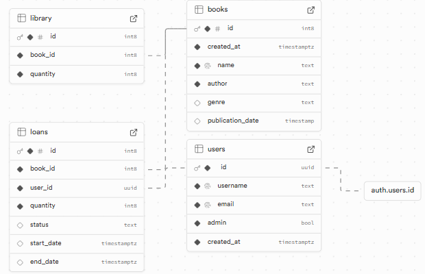
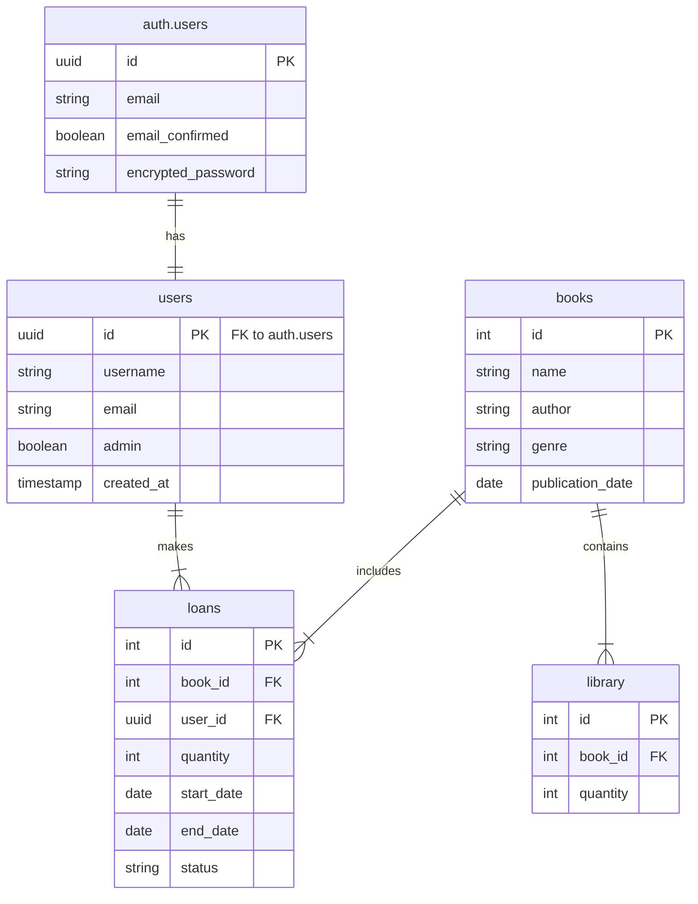

# 📚 Library Manager - Project Documentation

## Table of Contents

- [API Documentation](#api-documentation)
- [Database Architecture](#database-architecture)
  - [Database Schema](#database-schema)
  - [Supabase Auth Integration](#supabase-auth-integration)
- [Environment Setup](#environment-setup)

## 🔗 API Documentation

> All API calls are made from the React client using Supabase.

### 📖 Library Management (`/library.ts`)

#### List All Books

```typescript
GET /library

Response: {
  id: number,
  name: string,
  author: string,
  genre: string,
  publication_date: string,
  quantity: number
}[]
```

#### Add New Book

```typescript
POST /library

Body: {
  name: string,
  author: string,
  genre: string,
  publication_date: string,
  quantity: number
}
```

#### Update Book

```typescript
PUT /library/:id

Body: {
  name?: string,
  author?: string,
  genre?: string,
  publication_date?: string,
  quantity?: number
}
```

### 📋 Loan Management (`/loans.ts`)

#### Get Loans

```typescript
GET /loans

// Returns all loans (admin) or logged-in user's loans
Response: {
  id: number,
  book_name: string,
  quantity: number,
  username: string,
  status: string,
  start_date: string,
  end_date: string
}[]
```

#### Create Loan

```typescript
POST /loans

Body: {
  bookId: number,
  quantity: number,
  startDate: string,
  endDate: string,
  userId: string
}
```

### 👤 User Management (`/users.ts`)

#### Register User

```typescript
POST /register

Body: {
  email: string,
  password: string,
  username: string,
  admin: boolean
}
```

#### Authentication

```typescript
POST / login; // Login with email and password
POST / logout; // End current session
```

## 🏗️ Database Architecture

### Database Diagram



### Entity Relationship Diagram (Technical)



### 🔐 Supabase Auth Integration

User management in our application integrates with Supabase's authentication system as follows:

1. **`auth.users` Table**:

   - Native Supabase table that handles authentication
   - Stores credentials and sensitive data (encrypted passwords, tokens)
   - Automatically managed by Supabase Auth

2. **`public.users` Table**:
   - Our custom table that extends user information
   - Links to `auth.users` through the `id` field (UUID)
   - Stores application-specific data (username, admin role, etc.)

#### Registration Flow:

1. When a user registers, a record is first created in `auth.users`
2. Immediately after, using the generated UUID, we create a record in our `public.users` table
3. Supabase's RLS (Row Level Security) policies ensure users can only access their own data

```sql
-- Example RLS policy for users table
CREATE POLICY "Users can only view their own data"
ON public.users
FOR SELECT
USING (auth.uid() = id);
```

## 🗄️ Database Schema

### Tables

#### 📚 books

- `id`: Primary Key
- `name`: string
- `author`: string
- `genre`: string
- `publication_date`: date

#### 📦 library

- `id`: Primary Key
- `book_id`: Foreign Key
- `quantity`: number

#### 📝 loans

- `id`: Primary Key
- `book_id`: Foreign Key
- `user_id`: Foreign Key
- `quantity`: number
- `start_date`: date
- `end_date`: date
- `status`: string

#### 👥 users

- `id`: Primary Key
- `username`: string
- `email`: string
- `admin`: boolean
- `created_at`: timestamp

### Relationships

- `library.book_id` → `books.id`
- `loans.book_id` → `books.id`
- `loans.user_id` → `users.id`
- `users.id` ↔ `auth.users.id`

## ⚙️ Environment Setup

Create a `.env` file based on the following template:

```env
VITE_SUPABASE_URL=https://xxxx.supabase.co
VITE_SUPABASE_ANON_KEY=your-anon-key
```
