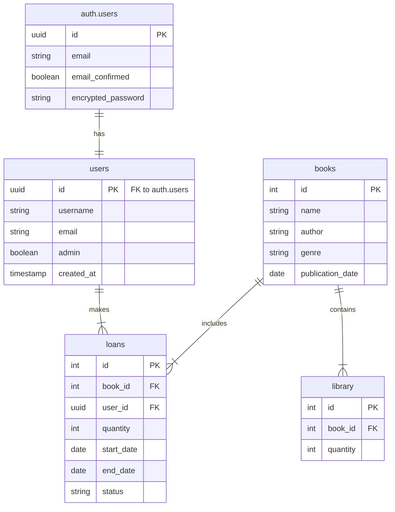

# 🏗️ Library Manager Backend Documentation

## Table of Contents

- [Database Architecture](#database-architecture)
  - [Database Overview](#database-overview)
  - [Entity Relationships](#entity-relationships)
  - [Supabase Integration](#supabase-integration)
- [Environment Setup](#environment-setup)

## Database Architecture

### Database Overview


Our database is built on Supabase and consists of several interconnected tables that manage the library system's data. The diagram above shows the relationship between these tables and their fields.

### Entity Relationships



### Table Descriptions

#### 📚 Books

Core table storing book information:

- `id`: Primary Key
- `name`: Book title
- `author`: Book author
- `genre`: Book genre
- `publication_date`: Publication date

#### 📦 Library

Manages book inventory:

- `id`: Primary Key
- `book_id`: Reference to books table
- `quantity`: Available copies

#### 📝 Loans

Tracks book loans:

- `id`: Primary Key
- `book_id`: Reference to borrowed book
- `user_id`: Reference to borrowing user
- `quantity`: Number of copies borrowed
- `start_date`: Loan start date
- `end_date`: Due date
- `status`: Loan status

#### 👥 Users

Stores user information:

- `id`: Primary Key (UUID)
- `username`: User's display name
- `email`: User's email
- `admin`: Administrative privileges
- `created_at`: Account creation timestamp

### Key Relationships

- Books ↔ Library: One-to-one inventory mapping
- Books ↔ Loans: One-to-many lending relationship
- Users ↔ Loans: One-to-many borrowing relationship
- Users ↔ auth.users: One-to-one authentication mapping

## 🔐 Supabase Integration

### Authentication System

The application leverages Supabase's built-in authentication system through a dual-table approach:

1. **`auth.users` Table**:

   - Managed by Supabase Auth
   - Handles authentication and security
   - Stores:
     - Encrypted passwords
     - Email verification status
     - Security tokens
     - Session data

2. **`public.users` Table**:
   - Custom application table
   - Extends user profiles
   - Links to `auth.users` via UUID
   - Stores application-specific data

### Security Implementation

#### Row Level Security (RLS)

Supabase RLS policies protect data access:

```sql
-- Users can only view their own data
CREATE POLICY "Users can only view their own data"
ON public.users
FOR SELECT
USING (auth.uid() = id);
```

#### Registration Process

1. User registration creates `auth.users` entry
2. Trigger creates corresponding `public.users` record
3. RLS policies activate for new user

## ⚙️ Environment Setup

Configure your environment by creating a `.env` file:

```env
VITE_SUPABASE_URL=https://xxxx.supabase.co
VITE_SUPABASE_ANON_KEY=your-anon-key
```
